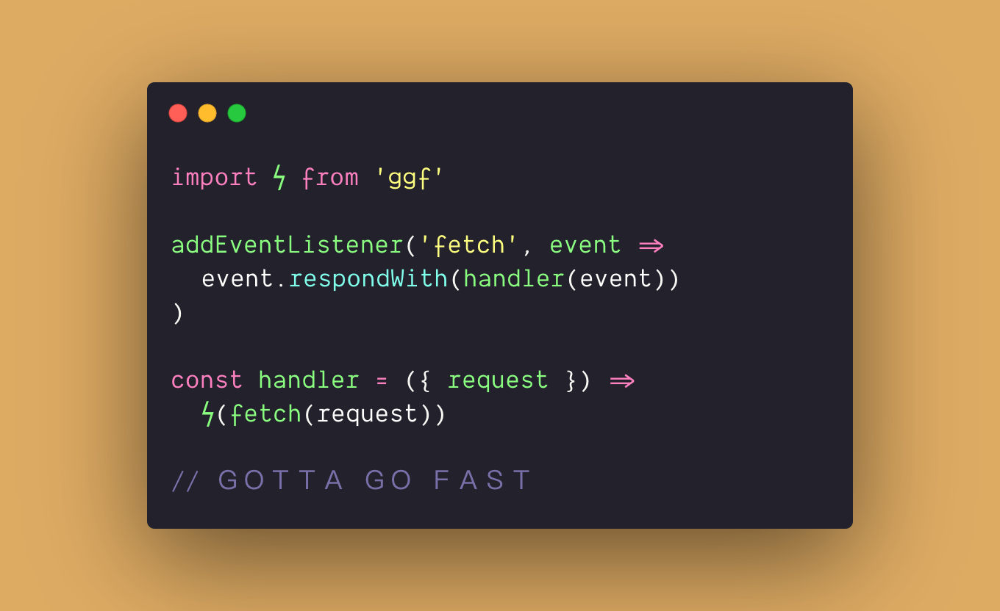

# ggf

a set of tools for speeding up websites using common optimizations. designed for cloudflare workers (and probably won't work with anything else).



## installation

```sh
$ npm i ggf
```

## usage

capture a response from your origin, and pass it through ggf. in three lines:

```js
import ϟ from 'ggf'
addEventListener('fetch', event => event.respondWith(handler(event)))
const handler = ({ request }) => ϟ(fetch(request))
```

and a longer sample:

```js
import ggf from 'ggf'
addEventListener('fetch', event => event.respondWith(handler(event)))
const handler = ({ request }) => {
  const resp = fetch(request)
  return ggf(resp)
}
```

## configuration

every optimization in GGF can be turned off (and some can be fine-tuned) by passing in a configuration option as the second argument to the function.

```js
// ...
ggf(resp, {
  // deferScripts (defaults to false)
  // lazyLoadImages (defaults to true)
  // version (defaults to true)
})
```

### defer scripts

resource-blocking scripts that cause high TTI can be blocked using the `deferScripts` configuration. this optimization can break sites, so it **disabled by default**. to enable:

```js
ggf(resp, {
  deferScripts: true
})
```

you may find that some scripts should not be deferred in order for your site to render correctly. to configure this, pass in an object to `deferScripts`, including the `options.except` array:

```js
ggf(resp, {
  deferScripts: {
    enabled: true,
    options: {
      except: ["/assets/js/app.min.js"]
    }
  }
})
```

you can also _skip_ scripts at the origin, by adding the data attribute `ggf-skip` to a `script` tag, as seen below:

```html
<script src="https://code.jquery.com/jquery-3.3.1.slim.min.js" data-ggf-skip="true"></script>
```

currently, scripts are excepted using a very basic `.includes()` check in the `script src` attribute. this probably doesn't work for everyone (and probably has some edge-cases), please feel free to submit a PR if you'd like to improve that behavior!

### lazy load images

using the `lazy` attribute, images are automatically lazy loaded and don't block the page from loading. this optimization is **enabled by default**. to disable it:

```js
ggf(resp, {
  lazyLoadImages: false
})
```

### version

as a sanity check to ensure that the code is working, ggf will add a `meta` tag to your site's `head`, with a property of `ggf:version`. this optimization is **enabled by default**. to disable it:

```js
ggf(resp, {
  versionMetaTag: false
})
```

ＧＯＴＴＡ ＧＯ ＦＡＳＴ
